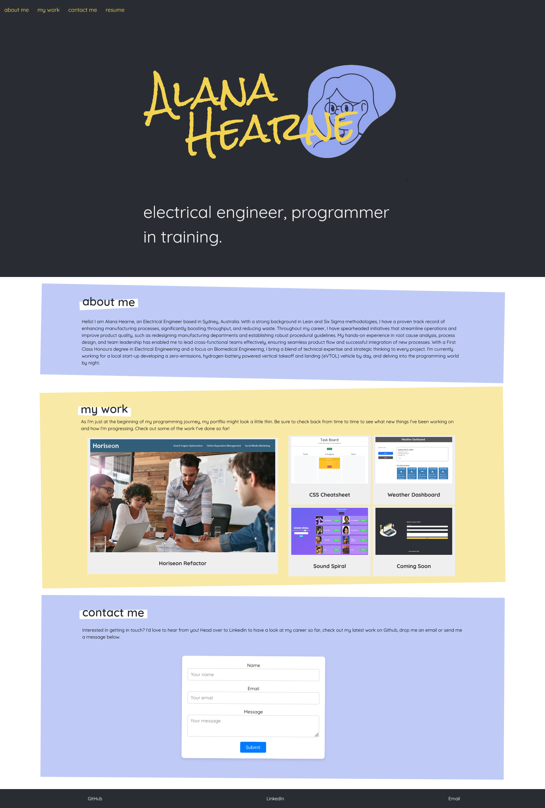

# React Portfolio


## Description

This is a personal portfolio built with React to showcase my skills, projects, and experience as a web developer. The application provides a responsive and polished user interface, allowing potential employers and collaborators to explore my work efficiently. It features different sections like "About Me", "Portfolio", "Contact", and more, all dynamically rendered using React components.

Developed through the execution of the following:

### User Story

```md
AS AN employer looking for candidates with experience building single-page applications
I WANT to view a potential employee's deployed React portfolio of work samples
SO THAT I can assess whether they're a good candidate for an open position
```

### Acceptance Criteria

```md
GIVEN a single-page application portfolio for a web developer
WHEN I load the portfolio
THEN I am presented with a page containing a header, a section for content, and a footer
WHEN I view the header
THEN I am presented with the developer's name and navigation with titles corresponding to different sections of the portfolio
WHEN I view the navigation titles
THEN I am presented with the titles About Me, Portfolio, Contact, and Resume, and the title corresponding to the current section is highlighted
WHEN I click on a navigation title
THEN the browser URL changes and I am presented with the corresponding section below the navigation and that title is highlighted
WHEN I load the portfolio the first time
THEN the About Me title and section are selected by default
WHEN I am presented with the About Me section
THEN I see a recent photo or avatar of the developer and a short bio about them
WHEN I am presented with the Portfolio section
THEN I see titled images of six of the developer’s applications with links to both the deployed applications and the corresponding GitHub repositories
WHEN I am presented with the Contact section
THEN I see a contact form with fields for a name, an email address, and a message
WHEN I move my cursor out of one of the form fields without entering text
THEN I receive a notification that this field is required
WHEN I enter text into the email address field
THEN I receive a notification if I have entered an invalid email address
WHEN I am presented with the Resume section
THEN I see a link to a downloadable resume and a list of the developer’s proficiencies
WHEN I view the footer
THEN I am presented with text or icon links to the developer’s GitHub and LinkedIn profiles, and their profile on a third platform (Stack Overflow, Twitter)
```

## Table of Contents

- [Installation](#installation)
- [Usage](#usage)
- [Features](#features)
- [Technologies](#technologies)
- [Screenshots](#screenshots)
- [License](#license)
- [Contact](#contact)

## Installation

To get a local copy of the project up and running, follow these steps:

1. Clone the repository:

   ```bash
   git clone https://github.com/ajhearne-mZAOSW/react-portfolio.git
   ```

2. Navigate to the project directory:

    ```bash
    cd react-portfolio
    ```

3. Install the dependencies:

    ```bash
    npm install
    ```

4. Run the development server:

    ```bash
    npm start
    ```

## Usage

Visit the live site at [https://ajhearne-portfolio.netlify.app](https://ajhearne-portfolio.netlify.app) or run it locally by following the installation instructions above. The app will open in your default browser at [http://localhost:3000/](http://localhost:3000/).

You can navigate through various sections of the portfolio:
- **About Me**: Overview of my background, skills, and interests.
- **Portfolio**: A showcase of the projects I've worked on, with links to live applications and GitHub repositories.
- **Contact**: A form to get in touch with me.
- **Resume**: A downloadable resume in PDF format.

## Features

- Responsive design for mobile, tablet, and desktop views.
- Dynamic routing using React Router for seamless navigation.
- Modular and reusable React components.
- Integration with email for contact forms.
- Interactive project gallery with links to live applications and code repositories.

## Technologies

- **React**: Front-end library for building user interfaces.
- **JavaScript (ES6+)**: For logic and interactivity.
- **HTML5**: Semantic markup.
- **CSS3**: Styling with a modern and responsive approach.
- **React Router**: For navigation between sections.
- **Node.js & npm**: Environment and package manager.

## Screenshots



## License

This project is licensed under the MIT License. See the [LICENSE](./LICENSE) file for details.

## Contact

Feel free to reach out if you have any questions or suggestions:

- **GitHub**: [ajhearne-mZAOSW](https://github.com/ajhearne-mZAOSW)
- **Project Repository**: [https://github.com/ajhearne-mZAOSW/react-portfolio](https://github.com/ajhearne-mZAOSW/react-portfolio)
